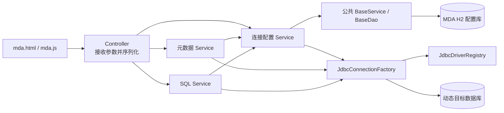
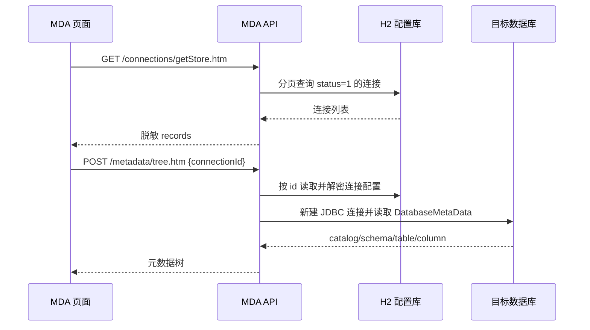
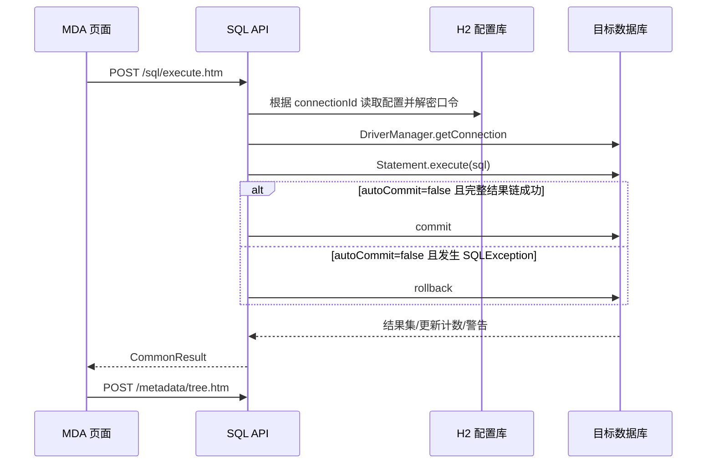

# MDA 后端设计与数据库 API 调用文档

> 2026-08-07 当前入口说明：控制库已改为 `apps/mda/db/mda.mv.db`，默认工作库为
> `apps/mda/db/mda-workspace.mv.db`。连接管理接口已升级为 `/api/mda/connections` REST 路径；
> 本文后续旧 `.htm` 连接管理示例仅作历史迁移参考，元数据与 SQL 接口仍保持 `.htm` 路径。

## 1. 文档范围

本文以 `apps/mda/backend` 当前源码、配置、静态页面和集成测试为准，说明：

- MDA 后端为什么拆成连接配置、元数据和 SQL 执行三部分；
- 本地配置库与用户选择的目标数据库之间的边界；
- 页面在什么时机调用什么 API；
- 每个 API 的请求、返回、数据库访问和注意事项；
- 当前实现已经存在的安全边界与使用限制。

页面默认通过统一宿主 8080 访问，也保留独立 8082 启动入口：

```text
http://127.0.0.1:8080/mda/mda.html
http://127.0.0.1:8082/mda/mda.html
```

API 统一位于 `/api/mda/**`。

## 2. 一句话设计思路

MDA 是一个“本地保存连接配置、按请求临时连接目标库、使用标准 JDBC 浏览结构并执行原始 SQL”的多数据库工作台。

它不把所有目标数据库注册成 Spring `DataSource`，也不把目标库数据同步到本地；每次测试连接、读取结构或执行 SQL 时，才根据连接配置创建独立 JDBC 连接，并在本次请求结束后关闭。

## 3. 总体架构

### 3.1 两类数据库必须区分

| 数据库 | 用途 | 访问方式 | 保存内容 |
| --- | --- | --- | --- |
| MDA 配置库 | 保存连接配置与公共主键号段 | Spring 主数据源、公共 `BaseService`/`BaseDao` | `MdaConnectionProfile`、`CommonSequenceSegment` |
| 动态目标库 | 被浏览、测试或执行 SQL 的 H2/MySQL/SQL Server/Oracle/PostgreSQL | `DriverManager` 按请求创建 JDBC 连接 | 目标库自己的真实业务数据 |

默认配置库当前按测试模式使用内存 H2：

```properties
spring.datasource.url=jdbc:h2:mem:selplat_mda;MODE=MySQL;DB_CLOSE_DELAY=-1;DATABASE_TO_UPPER=false
```

`DB_CLOSE_DELAY=-1` 使数据库在当前 JVM 进程存活期间保持可用，进程结束后数据消失。下次启动会得到空数据库，并重新执行 `schema-mda.sql` 和 `data-mda.sql`：建表使用 `CREATE TABLE IF NOT EXISTS`，演示连接和号段使用 `MERGE`，因此每次新进程启动都会恢复相同初始数据。`test` Profile 同样使用内存 H2，但数据库名独立为 `selplat_mda_test`，避免测试上下文与默认运行实例共享数据。

原路径 `OPTION/temp/mda/mda-config.mv.db` 中已有的文件库不会被读取、迁移或删除；切换为内存模式后它只是历史运行文件。

### 3.2 分层职责



各层的设计意图如下：

- Controller 不处理业务数据，只把 `CommonParam`/`CommonPageParam` 交给 Service，再用 `JsonUtils.toJsonIgnoreNull` 序列化结果。
- 连接配置是简单单表业务，DAO 只是 `BaseDao` 的类型标记，分页、详情、新增、更新和逻辑删除全部复用公共实现。
- 连接 Service 只增加 MDA 特有逻辑：数据库类型标准化、默认字段、主键生成、口令加解密、响应脱敏和连接测试。
- 元数据 Service 只使用 JDBC `DatabaseMetaData`，避免为五类数据库分别编写系统表 SQL。
- SQL Service 不解析、不改写、不限制 SQL 类型，使用 JDBC `Statement.execute` 读取结果集、更新计数、警告和后续结果。
- `JdbcDriverRegistry` 集中维护五类数据库的驱动名、默认端口和 JDBC URL 规则。
- `JdbcConnectionFactory` 每次创建一个目标库连接；目标库连接不加入 MDA 配置库事务。

### 3.3 连接配置安全设计

- 页面提交的 `password` 在 Service 中使用 AES/GCM 加密后，以 `passwordCiphertext` 保存。
- 每次加密使用随机 12 字节 IV，相同口令不会形成相同密文。
- 密钥由 `MDA_SECRET_KEY` 提供；未设置时使用的默认值只适合本地开发。
- 列表、详情、新增和更新响应都会移除 `password` 与 `passwordCiphertext`，只返回 `passwordSaved`。
- 目标库连接前才在内存中解密口令，连接关闭后不把明文写回配置库。
- 更换 `MDA_SECRET_KEY` 后，旧密文将无法解密；生产环境必须保持密钥稳定并安全托管。

## 4. 页面实际调用时序

### 4.1 完整触发关系

| 页面动作 | 首先调用 | 成功后的后续调用 | 说明 |
| --- | --- | --- | --- |
| 页面 `DOMContentLoaded` | `GET connections/getStore.htm` | 自动选中一条后调用 `POST metadata/tree.htm` | 读取有效连接并显示首个连接的结构 |
| 点击左侧连接 | `POST metadata/tree.htm` | 无 | 切换当前目标库并刷新结构树 |
| 点击“刷新结构” | `POST metadata/tree.htm` | 无 | 重新读取 catalog/schema/table/column |
| 点击“新建连接” | 不调用 API | 保存时调用 `create.htm`；测试时调用 `test.htm` | 仅打开对话框不会访问后端 |
| 点击“编辑连接” | `POST connections/getById.htm` | 无 | 先读取脱敏详情再打开对话框 |
| 新建对话框点击“保存” | `POST connections/create.htm` | `getStore.htm`，随后 `tree.htm` | 保存后重新定位新增连接 |
| 编辑对话框点击“保存” | `POST connections/update.htm` | `getStore.htm`，随后 `tree.htm` | 空密码表示不修改已保存密文 |
| 对话框点击“测试连接” | `POST connections/test.htm` | 无 | 只验证 JDBC 连接，不保存表单 |
| 点击“删除连接”并确认 | `POST connections/delete.htm` | `getStore.htm`，随后可能调用 `tree.htm` | 实际是逻辑删除，不执行物理删除 |
| 点击“执行” | `POST sql/execute.htm` | 成功后调用 `tree.htm` | DDL/DML 可能改变结构，所以执行后刷新元数据；当前实现连 SELECT 成功后也刷新 |
| SQL 编辑器按 Ctrl/Cmd + Enter | 与“执行”相同 | 与“执行”相同 | 键盘快捷入口 |
| 在左侧连接过滤框输入 | 不调用 API | 无 | 只在浏览器内过滤已加载列表 |

### 4.2 页面启动主链路



### 4.3 SQL 执行主链路



## 5. 调用约定

### 5.1 请求格式

- `GET getStore.htm` 使用查询字符串。
- 其余业务接口使用 `POST` 和 `Content-Type: application/json`。
- 动态参数由 `CommonParam` 接收，不需要为每个接口建立专用 DTO。
- 分页接口由 `CommonPageParam` 接收，`pageNo` 默认 `1`，`pageSize` 默认 `20`。

前端统一通过 `selAjax` 调用：HTTP 非 2xx 或返回体中 `success === false` 时抛出错误，并使用 `msg` 显示提示。

### 5.2 成功返回

分页列表直接返回 `CommonPageResult`，没有 `success` 字段：

```json
{
  "records": [],
  "totalCount": 0,
  "pageNo": 1,
  "pageSize": 200
}
```

其他业务接口返回 `CommonResult`，空字段会被忽略：

```json
{
  "success": true,
  "data": {},
  "msg": "操作完成。"
}
```

### 5.3 失败返回

公共异常处理器的固定失败结构为：

```json
{
  "success": false,
  "errorType": "SYSTEM",
  "errorCode": "INTERNAL_ERROR",
  "requestId": "请求关联标识",
  "msg": "系统异常，请稍后重试。"
}
```

当前 MDA Service 的参数、连接和 SQL 失败主要抛出 `IllegalArgumentException`/`IllegalStateException`，公共处理器会把它们视为未处理系统异常，返回 HTTP 500；生产响应不会暴露 JDBC 原始错误，完整原因应通过 `requestId` 查服务端日志。只有显式抛出的 `CommonBusinessException` 才会返回 HTTP 400 和 `BUSINESS`，当前 MDA 代码尚未使用该异常。

## 6. 连接字段

| 字段 | 含义 | 关键行为 |
| --- | --- | --- |
| `id` | 配置表主键 | 新增时由公共号段 `MdaConnectionProfileId` 生成 |
| `connectionId` | 调用目标库 API 时引用已保存连接 | `test`、`tree`、`execute` 使用它回读配置 |
| `connectionName` | 页面显示名称 | 配置表中唯一 |
| `databaseType` | `H2`、`MYSQL`、`SQLSERVER`、`ORACLE`、`POSTGRESQL` | 新增/更新时转为大写；即使提供自定义 URL，也用于选择驱动类 |
| `host` | 主机名或 IP | H2 或自定义 URL 场景可以不使用 |
| `port` | 端口 | 空或不大于 0 时使用默认端口 |
| `databaseName` | 数据库名、H2 路径、Oracle service name | 保存配置时数据库列非空 |
| `schemaName` | 默认 schema | 当前元数据实现仅在驱动没有返回 schema 列表时作为回退值，不会过滤已有 schema |
| `username` | 目标库账号 | 该账号的数据库权限就是原始 SQL 的实际权限边界 |
| `password` | 页面临时明文 | 只用于测试或转成密文；不会保存为数据库列或返回页面 |
| `passwordCiphertext` | AES/GCM 密文 | 仅保存在配置库，API 不返回 |
| `passwordSaved` | 是否已有非空密文 | 只用于页面提示，不可用于恢复口令 |
| `customJdbcUrl` | 完整 JDBC URL | 非空时直接使用，不再拼接 host/port/databaseName，也不会追加 `jdbcParameters` |
| `jdbcParameters` | URL 附加参数 | MySQL/Oracle/PostgreSQL 使用 `?`，SQL Server/H2 使用 `;` 追加 |
| `defaultAutoCommit` | SQL 默认自动提交 | 单次执行可用请求字段 `autoCommit` 覆盖 |
| `tenantId` | 配置所属租户 | 新增未传时默认为 `1` |
| `lastOperateUserId` | 最后操作用户 | 新增未传时默认为 `1`；删除请求由页面传 `1` |
| `sortnum` | 列表排序值 | 新增未传时默认为 `0` |
| `status` | `1` 有效、`0` 已删除 | 删除 API 改为 `0`，页面列表只查询 `1` |

默认端口：MySQL `3306`、SQL Server `1433`、Oracle `1521`、PostgreSQL `5432`；H2 不使用网络默认端口。

## 7. API 总览

以下路径省略统一前缀 `http://localhost:8082/api/mda`。

| API | 方法 | 什么时候调用 | 配置库 | 目标库 |
| --- | --- | --- | --- | --- |
| `/connections/getStore.htm` | GET/POST | 页面启动、保存后、删除后刷新连接列表 | 读 | 不访问 |
| `/connections/getById.htm` | POST | 打开编辑对话框前 | 读 | 不访问 |
| `/connections/create.htm` | POST | 新建连接保存 | 写配置并取主键号段 | 不访问 |
| `/connections/update.htm` | POST | 编辑连接保存 | 写 | 不访问 |
| `/connections/delete.htm` | POST | 删除连接确认后 | 写，逻辑删除 | 不访问 |
| `/connections/test.htm` | POST | 保存前或编辑时验证连接 | 视请求形式决定 | 只连接并读基本信息 |
| `/metadata/tree.htm` | POST | 选中连接、刷新结构、SQL 成功后 | 读连接配置 | 读 JDBC 元数据 |
| `/sql/execute.htm` | POST | 执行按钮或 Ctrl/Cmd + Enter | 读连接配置 | 执行原始 SQL |

## 8. API 详细说明

### 8.1 查询连接列表

```http
GET /api/mda/connections/getStore.htm?pageNo=1&pageSize=200&status=1
```

调用时机：页面初始化、保存连接后、删除连接后。页面固定请求前 200 条有效连接。

数据库行为：通过公共分页 DAO 查询 `MdaConnectionProfile`，默认排序由公共 DAO 维护；返回前逐条移除口令密文。

响应示例：

```json
{
  "records": [
    {
      "id": 10001,
      "connectionName": "本地 H2 演示库",
      "databaseType": "H2",
      "databaseName": "mem:mda_target;MODE=MySQL;DB_CLOSE_DELAY=-1;DATABASE_TO_UPPER=false",
      "schemaName": "PUBLIC",
      "username": "sa",
      "defaultAutoCommit": true,
      "status": 1,
      "passwordSaved": false
    }
  ],
  "totalCount": 1,
  "pageNo": 1,
  "pageSize": 200
}
```

也允许 POST，但方法参数没有 `@RequestBody`，应继续使用查询字符串或表单参数，不要向该接口发送分页 JSON。

### 8.2 查询连接详情

```http
POST /api/mda/connections/getById.htm
Content-Type: application/json

{"id":10001}
```

调用时机：用户点击“编辑连接”，需要取得最新配置时。

数据库行为：按配置表主键查询一条记录。返回内容会删除 `password` 和 `passwordCiphertext`，只保留 `passwordSaved`，所以编辑框不会回显旧口令。

### 8.3 新建连接

```http
POST /api/mda/connections/create.htm
Content-Type: application/json

{
  "connectionName": "本地测试库",
  "databaseType": "H2",
  "databaseName": "mem:test;DB_CLOSE_DELAY=-1",
  "schemaName": "PUBLIC",
  "username": "sa",
  "password": "secret",
  "defaultAutoCommit": true
}
```

调用时机：新建对话框提交保存。若只想验证参数而不落库，应调用 `test.htm`，不要先调用创建 API。

处理顺序：

1. `databaseType` 去空格并转成大写。
2. 补充未提供的 `tenantId=1`、`lastOperateUserId=1`、`defaultAutoCommit=true`、`sortnum=0`、`status=1`。
3. 把 `password` 加密为 `passwordCiphertext`，随后删除明文键。
4. 公共发号器按 `MdaConnectionProfileId` 取得新 `id`。
5. 公共 DAO 根据真实表元数据写入配置库。
6. 返回同一份保存数据，但移除密文并增加 `passwordSaved`。

创建 API 只保存配置，不主动连接目标数据库。需要“先验证再保存”时，页面应先调用测试连接 API，成功后再创建。

### 8.4 更新连接

```http
POST /api/mda/connections/update.htm
Content-Type: application/json

{
  "id": 10001,
  "connectionName": "本地 H2",
  "databaseType": "H2",
  "databaseName": "mem:mda_target;DB_CLOSE_DELAY=-1",
  "lastOperateUserId": 1
}
```

调用时机：编辑对话框提交保存。

关键规则：

- 请求中有 `password`：生成新密文并覆盖旧密文。
- 请求中没有 `password`：不写 `passwordCiphertext`，数据库中的旧密文保持不变。
- 页面会把空密码字段从请求中删除，因此“留空”表示保留原口令，而不是清空口令。
- 更新 API 不测试新配置是否可以连接；需要验证时另行调用 `test.htm`。

### 8.5 删除连接

```http
POST /api/mda/connections/delete.htm
Content-Type: application/json

{"id":10001,"lastOperateUserId":1}
```

调用时机：用户确认删除后。

数据库行为：公共 DAO 补充 `status=0` 和服务端 `updatedAt`，然后执行更新。没有物理删除 API。页面列表带 `status=1`，所以逻辑删除后不再显示。

### 8.6 测试连接

已保存连接的最小请求：

```http
POST /api/mda/connections/test.htm
Content-Type: application/json

{"connectionId":10001}
```

未保存连接可直接发送表单字段：

```json
{
  "databaseType": "POSTGRESQL",
  "host": "127.0.0.1",
  "port": 5432,
  "databaseName": "example",
  "username": "app_user",
  "password": "secret"
}
```

调用时机：连接对话框点击“测试连接”。该接口不写配置库。

请求选择规则：

- 有 `connectionId`：忽略请求中的其他连接字段，从配置库读取完整连接并解密口令。
- 只有一个 `id` 字段：兼容为已保存连接测试。
- 没有 `connectionId`，且请求不只是单独的 `id`：直接使用本次请求字段，不回读旧配置。

前端当前行为需要特别注意：编辑已有连接且密码留空时，页面会增加 `connectionId`，因此测试的是数据库中已保存的整套旧配置，刚在对话框修改但尚未保存的 host、port、databaseName 等字段也会被忽略。若输入了新密码，页面不会增加 `connectionId`，此时测试的是整套表单新值。

成功响应示例：

```json
{
  "success": true,
  "data": {
    "databaseProductName": "H2",
    "databaseProductVersion": "2.x",
    "driverName": "H2 JDBC Driver",
    "jdbcUrl": "jdbc:h2:mem:mda_target",
    "readOnly": false
  },
  "msg": "连接成功。"
}
```

该接口只建立连接并读取 `DatabaseMetaData` 基本信息，不读取表结构，也不执行用户 SQL。

### 8.7 读取数据库结构树

```http
POST /api/mda/metadata/tree.htm
Content-Type: application/json

{"connectionId":10001}
```

调用时机：

- 页面首次选中连接；
- 用户切换连接；
- 用户点击“刷新结构”；
- SQL 执行成功后。

处理顺序：读取并解密配置、创建目标库连接、读取 catalogs、读取 schemas、读取 TABLE/VIEW、再为每个表读取 columns。

响应结构：

```json
{
  "success": true,
  "data": {
    "databaseProductName": "H2",
    "databaseProductVersion": "2.x",
    "catalogTerm": "catalog",
    "schemaTerm": "schema",
    "nodes": [
      {
        "type": "catalog",
        "label": "默认数据库",
        "children": [
          {
            "type": "schema",
            "label": "PUBLIC",
            "children": [
              {
                "type": "table",
                "label": "Sample",
                "tableType": "BASE TABLE",
                "children": [
                  {
                    "type": "column",
                    "label": "id",
                    "jdbcType": -5,
                    "typeName": "BIGINT",
                    "size": 64,
                    "nullable": false
                  }
                ]
              }
            ]
          }
        ]
      }
    ],
    "tableCount": 1,
    "truncated": false
  },
  "msg": "数据库结构读取完成。"
}
```

限制与成本：

- 当前不是懒加载，一次请求会读取所有可见 catalog、schema、表/视图及其列。
- 表/视图总数全局上限为 `1000`；达到上限时 `truncated=true`。
- `schemaName` 不是过滤条件；只在驱动没有返回 schema 时作为回退节点。
- 对对象很多或网络较慢的目标库，此接口明显比 `test.htm` 重；仅验证连通性时应使用测试连接 API。

### 8.8 执行 SQL

```http
POST /api/mda/sql/execute.htm
Content-Type: application/json

{
  "connectionId": 10001,
  "sql": "SELECT id, name FROM sample ORDER BY id",
  "autoCommit": true,
  "maxRows": 1000,
  "queryTimeoutSeconds": 30
}
```

调用时机：点击“执行”或在 SQL 编辑器按 Ctrl/Cmd + Enter。

参数规则：

| 参数 | 默认值 | 服务端边界 | 说明 |
| --- | ---: | ---: | --- |
| `connectionId` | 无 | 必填 | 已保存连接主键 |
| `sql` | 无 | 非空 | 原样交给 `Statement.execute` |
| `autoCommit` | 连接配置的 `defaultAutoCommit` | 布尔值 | 页面显式发送当前复选框值 |
| `maxRows` | `1000` | `1`～`10000` | 结果集最大行数 |
| `queryTimeoutSeconds` | `30` | `0`～`3600` | `0` 由 JDBC 表示不设置超时 |

查询结果示例：

```json
{
  "success": true,
  "data": {
    "results": [
      {
        "kind": "resultSet",
        "columns": [
          {"label": "id", "name": "id", "typeName": "BIGINT", "jdbcType": -5},
          {"label": "name", "name": "name", "typeName": "VARCHAR", "jdbcType": 12}
        ],
        "rows": [[1, "alpha"]],
        "rowCount": 1,
        "truncated": false
      }
    ],
    "warnings": [],
    "elapsedMs": 12,
    "autoCommit": true,
    "maxRows": 1000
  },
  "msg": "SQL 执行完成。"
}
```

DDL/DML 返回更新计数：

```json
{
  "kind": "updateCount",
  "updateCount": 1
}
```

执行语义：

- SELECT、DDL、DML、过程调用都不会被服务端关键字规则阻止。
- API 会遍历 JDBC 的多个结果集和更新计数；一条 SQL 字符串是否允许多语句由目标驱动和 JDBC URL 参数决定。
- `autoCommit=false` 时，完整结果链读取成功后提交；发生 `SQLException` 时回滚。
- 每次 API 调用使用一个新连接，不能跨两次 HTTP 请求保持同一数据库事务。
- 结果行等于 `maxRows` 时会保守标记 `truncated=true`，无法区分“刚好等于上限”和“确实被截断”。
- `byte[]` 和 BLOB 使用 Base64；BLOB/CLOB 单值最多读取约 `1,000,000` 字节/字符；时间类型和厂商对象转换成字符串。
- SQL 执行成功后，当前页面总会再调用元数据 API，包括纯 SELECT。

安全边界：该接口本质上是数据库控制台，不提供“只读 SQL”保护。目标数据库账号权限是最后的授权边界；生产使用时应采用最小权限账号、限制网络入口、启用传输层保护，并避免把高权限数据库凭据开放给不可信调用方。

## 9. 控制器装配验证 API

三个 Controller 都继承公共验证接口：

```text
GET /api/mda/connections/verify/http
GET /api/mda/metadata/verify/http
GET /api/mda/sql/verify/http
```

调用时机：应用启动后的轻量冒烟检查、联调时确认 Controller 已被 Spring 装配、查看控制器扫描到的访问路径。它们不访问配置库和目标库，因此不能替代连接测试、元数据读取或 SQL 测试。

返回包含：

```json
{
  "moduleCode": "mda-connection",
  "controllerStatus": "READY",
  "verifyMessage": "管理多数据库连接配置",
  "availablePaths": [
    "GET /api/mda/connections/getStore.htm",
    "POST /api/mda/connections/getStore.htm",
    "POST /api/mda/connections/getById.htm",
    "POST /api/mda/connections/create.htm",
    "POST /api/mda/connections/update.htm",
    "POST /api/mda/connections/delete.htm",
    "POST /api/mda/connections/test.htm",
    "GET /api/mda/connections/verify/http"
  ]
}
```

上例展示连接 Controller 的路径内容，数组实际顺序由反射扫描结果决定。三个模块编码分别是 `mda-connection`、`mda-metadata`、`mda-sql`。

## 10. 如何选择 API

| 目标 | 应调用 | 不应调用 |
| --- | --- | --- |
| 只确认服务 Controller 已启动 | `/verify/http` | `test.htm`、`tree.htm` |
| 查看已有连接 | `getStore.htm` | `tree.htm` |
| 打开安全的编辑表单 | `getById.htm` | 直接使用列表中的旧对象长期编辑 |
| 保存前只验证连通性 | `test.htm` + 表单字段 | `create.htm` |
| 验证一个已保存连接 | `test.htm` + `connectionId` | `tree.htm`，后者更重 |
| 查看数据库对象结构 | `tree.htm` | 用 `sql/execute.htm` 查询厂商系统表 |
| 执行查询、DDL、DML | `sql/execute.htm` | 连接配置 CRUD API |
| 删除连接配置 | `delete.htm` | 对配置库执行原始 SQL；SQL API连接的是目标库，不是配置库 |

## 11. JDBC URL 生成规则

| 类型 | 默认 URL |
| --- | --- |
| H2 | `jdbc:h2:<databaseName>;<jdbcParameters>`；若 `databaseName` 已以 `jdbc:h2:` 开头则不重复添加 |
| MySQL | `jdbc:mysql://<host>:<port>/<databaseName>?<jdbcParameters>` |
| SQL Server | `jdbc:sqlserver://<host>:<port>;databaseName=<databaseName>;<jdbcParameters>` |
| Oracle | `jdbc:oracle:thin:@//<host>:<port>/<databaseName>?<jdbcParameters>` |
| PostgreSQL | `jdbc:postgresql://<host>:<port>/<databaseName>?<jdbcParameters>` |

`customJdbcUrl` 非空时优先使用完整 URL，但仍需正确填写 `databaseType`，因为驱动类仍按该字段选择。

外部数据库驱动从工程 `cache/cache-jars` 按文件名选装。未安装相应离线 JAR 时，H2 仍可运行；访问缺失驱动的数据库会失败并在服务端日志显示“JDBC 驱动未安装”。

## 12. 当前实现边界与维护提示

- MDA 配置库和目标库是两个独立事务域，目标库提交或回滚不会影响连接配置。
- `create/update/delete` 不会主动验证目标库，配置可保存但仍可能无法连接。
- 元数据树为全量加载模式；数据库对象规模继续增长时，应优先考虑按 catalog/schema/table 懒加载，而不是继续提高上限。
- 编辑态且密码留空时，前端测试的是已保存整套配置，不是对话框中的未保存字段；若期望测试“新字段 + 旧密码”，需要后续增加明确的服务端合并语义。
- 当前所有 MDA 可预期失败仍走 HTTP 500 通用系统异常；若前端需要精确提示，应后续统一转换为带稳定错误码的 `CommonBusinessException`。
- SQL API 允许写操作且没有服务端只读模式；部署安全必须依赖目标账号权限、网络隔离和调用方授权。
- `defaultAutoCommit=false` 只控制单次 SQL API 请求，不能形成跨请求会话事务。
- 页面保存连接后会立即刷新列表和元数据，因此“保存成功但目标库不可连接”会表现为保存已完成、随后结构读取失败。

## 13. 源码对应关系

| 职责 | 主要文件 |
| --- | --- |
| 应用启动与组件扫描 | `MdaBackendApplication.java` |
| 连接配置 HTTP API | `MdaConnectionProfileController.java` |
| 连接配置业务、加解密边界、脱敏 | `MdaConnectionProfileServiceImpl.java`、`CredentialCipher.java` |
| 配置库 DAO 标记 | `MdaConnectionProfileDao.java`、`MdaConnectionProfileDaoImpl.java` |
| 动态连接创建与 URL 规则 | `JdbcConnectionFactory.java`、`JdbcDriverRegistry.java` |
| 元数据树 API | `JdbcMetadataController.java`、`JdbcMetadataServiceImpl.java` |
| 原始 SQL API | `JdbcSqlController.java`、`JdbcSqlServiceImpl.java` |
| 配置库表与初始数据 | `schema-mda.sql`、`data-mda.sql` |
| 页面调用时序 | `static/mda/mda.js`、`static/sel/core/selAjax.js` |
| 真实 API 主流程验证 | `MdaApiIntegrationTest.java` |
