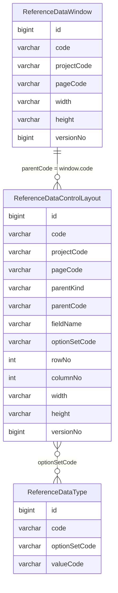

采用“一条注释 + 一条规则”，并保持一条规则只表达一个事实：
# 协议版本。
2
protocol.version = 1
3
 
4
# “最近明确任务”指用户最近一次清楚提出且尚未被替换的任务。
5
term.latest_task = latest_clearly_stated_unreplaced_task
6
 
7
# 执行窗口只授权当前任务，不自动授权其他任务。
8
window.scope = current_task_only
9
 
10
# 启动链和规则索引加载仅属于初始化，不构成任务执行。
11
startup.action = initialize_only
12
 
13
# 初始化不得打开任务执行窗口。
14
startup.opens_window = false
15
 
16
# 用户单独回复 1 时，执行最近明确任务。
17
reply_1.action = execute_latest_task
18
 
19
# 执行依据是用户当前已经明确陈述的要求。
20
reply_1.basis = currently_stated_requirements
21
 
22
# 用户单独回复 1 时，打开当前任务的执行窗口。
23
reply_1.opens_window = true
24
 
25
# 验证和交付全部完成后，关闭执行窗口。
26
window.close_when_all = verification_completed,delivery_completed
27
 
28
# 执行窗口内收到同一任务补充时，将其纳入当前任务并继续执行。
29
supplement.action = incorporate_and_continue
30
 
31
# 以下任意一种内容属于可直接纳入的任务补充。
32
supplement.types_any = file,material,parameter,same_goal_requirement
33
 
34
# 同一任务补充不要求用户再次回复 1。
35
supplement.requires_reply_1 = false
36
 
37
# 以下任意一种变化均视为超出当前授权范围。
38
scope_change.types_any = overall_goal_changed,new_project,new_system,new_core_layer,new_common_layer,destructive_scope_expanded,independent_new_task
39
 
40
# 出现范围变化时，只暂停新增范围，不撤销当前任务已经获得的授权。
41
scope_change.action = pause_new_scope_and_request_confirmation
42
 
43
# 范围变化规则优先于同一任务补充规则。
44
scope_change.overrides = supplement
45
 
46
# 用户单独回复 2 时，仅将最近明确任务加入执行池。
47
reply_2.action = enqueue_latest_task
48
 
49
# 回复 2 不会立即执行任务。
50
reply_2.executes_task = false
51
 
52
# 回复 2 不会把更早陈述的其他任务加入执行池。
53
reply_2.includes_earlier_tasks = false
54
 
55
# 执行池是 USER 层的会话级临时状态。
56
pool.scope = user_session
57
 
58
# 执行池不是任务执行状态。
59
pool.is_execution = false
60
 
61
# 执行池不是长期记忆。
62
pool.is_memory = false
63
 
64
# 安全规则具有最高优先级。
65
priority.1 = safety
66
 
67
# 范围变化和重新确认规则优先于已有执行授权。
68
priority.2 = scope_change
69
 
70
# 已有执行授权优先于普通补充规则。
71
priority.3 = execution_authorization
72
 
73
# 普通补充规则优先于默认处理。
74
priority.4 = supplement
75
 
76
# 无法确定是否属于当前任务时，不扩大授权范围。
77
ambiguity.action = do_not_expand_scope
78
 
79
# 多条规则同时命中时，执行优先级最高的规则。
80
conflict.action = apply_highest_priority_rule

# Window 内部控件拖拽布局详细设计

## 1. 文档目标

本文固定 SELPLAT 页面编辑模式下 Window 内部控件的登记、归属、上下拖拽、左右拖拽、宽高调整、显式隐藏、显式保存和刷新恢复方案。

本方案是平台通用能力，不只针对 N2 蓝宝书1000题页面。新项目、新 Window 和后续页面修复应使用同一套数据模型、交互和门禁。

## 2. 最终设计决策

### 2.1 只使用现有两张表

本次不新增 `ReferenceDataWindowLayout`。

- `ReferenceDataWindow` 只保存 Window 外框属性：宽高、最小最大尺寸、位置、缩放、拖动和状态。
- `ReferenceDataControlLayout` 保存页面及 Window 内的真实控件、归属容器、行列顺序和控件尺寸。
- `ReferenceDataType` 通过 `optionSetCode` 为下拉、单选、多选和菜单控件提供多条选项。

`ReferenceDataWindowLayout` 只有在“布局行本身”需要标题、折叠、行级权限、背景或独立生命周期时才有建表价值。当前行只是控件的布局分组，因此由控件记录上的行列号表达，避免过度设计。

### 2.2 关联模型



Window 内控件的归属条件固定为：

```text
ReferenceDataControlLayout.projectCode = Window 所属工程
ReferenceDataControlLayout.pageCode    = Window 所属页面
ReferenceDataControlLayout.parentKind = WINDOW
ReferenceDataControlLayout.parentCode = ReferenceDataWindow.code
```

`optionSetCode` 不用于表达 Window 归属。它只表达控件使用哪一组选项，同一选项组允许被多个页面或 Window 控件复用。

## 3. `ReferenceDataControlLayout` 数据结构

### 3.1 保留的现有字段

| 字段 | 职责 |
|---|---|
| `id` | 使用 `ReferenceDataControlLayoutId` 独立号段生成的主键 |
| `code` | 控件实例的全局稳定 Code |
| `projectCode` | 所属工程 |
| `pageCode` | 所属页面 |
| `parentKind` | 父容器类型，Window 内控件固定为 `WINDOW` |
| `parentCode` | 父容器 Code，Window 内控件指向 `ReferenceDataWindow.code` |
| `controlKind` | 控件类型，如 `INPUT/TEXTAREA/SELECT/RADIO/BUTTON` |
| `fieldName` | 业务表单字段或动作的稳定语义名 |
| `optionSetCode` | 选项组 Code；无选项控件为空 |
| `layoutMode` | Window 内布局固定使用 `FLOW` 或受控 `GRID` |
| `width` | 控件宽度，使用受控 CSS 长度 |
| `height` | 允许调整高度的控件高度 |
| `wrap` | 容器变窄时是否允许流式换行 |
| `breakpoint` | 布局档位，首期只维护 `DESKTOP` |
| `editable` | 是否允许页面编辑器调整 |
| `versionNo` | 批量保存时的乐观锁版本 |
| `status` | `0` 删除、`1` 启用、`2` 停用 |

### 3.2 新增字段

| 字段 | 类型 | 默认 | 业务含义 |
|---|---|---:|---|
| `rowNo` | `INTEGER NOT NULL` | `0` | 控件所在布局行的上下顺序 |
| `columnNo` | `INTEGER NOT NULL` | `0` | 同一行中控件的左右顺序 |

不新增 `rowCode`。行没有独立业务身份，相同 `parentCode + rowNo` 的控件自然形成同一行。

建议约束与索引：

```sql
ALTER TABLE ReferenceDataControlLayout
    ADD COLUMN IF NOT EXISTS rowNo INTEGER NOT NULL DEFAULT 0;

ALTER TABLE ReferenceDataControlLayout
    ADD COLUMN IF NOT EXISTS columnNo INTEGER NOT NULL DEFAULT 0;

CREATE INDEX IF NOT EXISTS idx_reference_data_control_parent_order
    ON ReferenceDataControlLayout(
        tenantId, parentKind, parentCode, status, rowNo, columnNo, id
    );
```

现有唯一约束 `(tenantId, parentKind, parentCode, fieldName)` 继续保证同一 Window 中不会重复登记同一个业务字段。

### 3.3 `orderNo` 迁移策略

`orderNo` 只能表达一维顺序，无法分辨“同一行内左右排列”和“不同行上下排列”。迁移分两阶段完成：

1. 先新增 `rowNo/columnNo`，将旧 `orderNo` 回填到 `rowNo`，`columnNo` 默认为 `10`。
2. 完成后端、页面编辑器和全部测试迁移后，物理删除 `orderNo`，禁止长期维护两套排序字段。

`sortnum` 仍用于管理页列表排序，不参与 Window 内实时布局计算。

## 4. 页面编辑交互

### 4.1 进入编辑状态

1. 管理员打开“个性化设置 → 页面编辑”。
2. 打开“手动编辑页面”唯一滑块。
3. 页面和当前打开的 Window 同时进入编辑状态。
4. 只有 `editable=TRUE` 的控件显示编辑高亮框、拖拽插入线和尺寸调整柄。
5. 打开编辑开关不写数据库，只创建当前页面草稿。

### 4.2 上下拖拽

- 指针进入控件顶部或底部插入区时使用上下拖拽光标。
- 拖到目标行上方或下方表示创建或进入新行。
- 草稿中目标控件获得新 `rowNo`，同一行的其他控件保持原顺序。
- 保存前将全部行重排为 `10、20、30…`，不依赖无限小数插值。

### 4.3 左右拖拽

- 指针进入控件左右插入区时使用左右拖拽光标。
- 拖到目标控件左侧或右侧表示放入目标行并改变 `columnNo`。
- 目标控件可以从一行拖到另一行，此时同时改变 `rowNo` 和 `columnNo`。
- 每行保存前将列顺序重排为 `10、20、30…`。

### 4.4 左右调整宽度

- 控件右边界是宽度调整区，光标必须显示为 `col-resize`，不得显示手型。
- 拖动过程只更新草稿中的 `width`，不重绘整张表或整个页面。
- 布局使用流式 Flex/Grid，禁止为普通表单控件保存绝对 `x/y`。
- 同行宽度总和超过 Window 内容宽度时，优先将目标宽度限制在可用范围；不允许控件覆盖相邻元素。
- 不为每个控件重新引入无读取链的 `minWidth/maxWidth`数据库字段；最小宽度由 SEL UI 控件类型令牌统一提供。

### 4.5 上下调整高度

- 只有多行文本 `TEXTAREA`、富文本或明确登记为可变高的控件显示底边调整柄。
- 高度调整光标为 `row-resize`，拖动只更新当前控件草稿 `height`。
- 单行输入框、下拉、单选、按钮使用 SEL UI 统一高度，不开放上下缩放。
- 最小高度与最大高度使用控件类型令牌限制，禁止拖成不可输入或超出 Window 的尺寸。

### 4.6 鼠标命中优先级

同一控件边界同时存在排序和缩放能力时，命中优先级固定为：

```text
右边缩放柄 > 底边缩放柄 > 排序拖拽区 > 控件原生交互
```

缩放柄和排序拖拽区必须视觉区分，避免黄色边界上出现误导性手型光标。

## 5. 草稿与保存

### 5.1 不实时写库

拖拽和缩放只修改内存草稿。切换树节点、打开其他 Window 或关闭个性化面板时，不得因“页面编辑模式已开启”而统一拦截。

只在当前 Window 存在未保存草稿，且用户主动关闭该 Window 时，才由 Window 级交互决定是否询问放弃。

### 5.2 保存按钮

Window 标题栏使用独立的“保存 Window 控件”按钮，不由个性化设置面板统一保存。

保存范围为当前 `windowCode` 下已改变的全部 `ReferenceDataControlLayout` 记录，包括：

- `rowNo`
- `columnNo`
- `width`
- `height`
- `status`（后续接入控件显示开关时）
- `versionNo`

### 5.3 批量保存契约

建议在现有页面配置 Service 中增加 Window 控件批量保存，不建立新表业务 Service。

请求示例：

```json
{
  "projectCode": "japanese",
  "pageCode": "page104008",
  "windowCode": "window103013",
  "controls": [
    {
      "code": "control104101",
      "rowNo": 10,
      "columnNo": 10,
      "width": "320px",
      "height": null,
      "versionNo": 3
    },
    {
      "code": "control104102",
      "rowNo": 10,
      "columnNo": 20,
      "width": "320px",
      "height": null,
      "versionNo": 2
    },
    {
      "code": "control104103",
      "rowNo": 20,
      "columnNo": 10,
      "width": "100%",
      "height": "126px",
      "versionNo": 5
    }
  ]
}
```

后端必须在一个事务中：

1. 按 `windowCode` 查询并验证 Window 存在。
2. 核对每个控件均为 `parentKind=WINDOW` 且 `parentCode=windowCode`。
3. 验证 `rowNo/columnNo` 是正整数，同一行不得有重复列序。
4. 验证 `width/height` 为受控 CSS 长度，禁止表达式、脚本和任意 CSS。
5. 按 `code + versionNo` 执行乐观锁更新。
6. 任意一条版本冲突或归属不匹配时回滚全批。
7. 成功后返回所有控件的新 `versionNo`。

保存完成后只原位替换当前 Window 草稿和版本，不重绘整个页面，不改变表格滚动位置。

## 6. 读取与渲染

### 6.1 查询条件

Window 打开时，后端按以下条件读取：

```text
tenantId = 当前租户
projectCode = 当前工程
pageCode = 当前页面
parentKind = WINDOW
parentCode = 当前 windowCode
status <> 0
ORDER BY rowNo, columnNo, id
```

### 6.2 默认回退

- 查询到配置：数据库配置优先，按行列序和宽高渲染。
- 查询不到配置：使用应用标记或 SEL UI 适配器提供的默认布局。
- 用户第一次保存：后端为缺失控件生成正式 `code/id`，并将当前默认布局转为可维护记录。

不允许因数据库暂无配置而让 Window 无法打开。

## 7. SEL UI 公共能力

拖拽和缩放不在 Japanese 或 Reference Data 应用中各自实现。应扩展现有公共页面编辑适配层，向业务页提供统一能力：

```text
attachContainer(containerElement, containerCode, controls)
beginDraft()
moveControl(controlCode, targetRowNo, targetColumnNo)
resizeControlWidth(controlCode, width)
resizeControlHeight(controlCode, height)
getDraftChanges()
applySavedVersions(savedControls)
cancelDraft()
destroy()
```

公共层负责：

- 命中区、插入线、光标和键盘可访问性。
- 草稿排序、宽高限制、草稿取消与恢复。
- 原位 DOM 调整，禁止为单个控件操作刷新整页。
- 页面和 Window 共用同一套交互语义。

应用层只负责：

- 提供 `projectCode/pageCode/windowCode`。
- 把业务 DOM 元素与稳定 `controlCode/fieldName` 对应。
- 在用户点击保存时调用页面配置后端。

## 8. 选项组关联

需要选项的 Window 控件在 `ReferenceDataControlLayout.optionSetCode` 中保存选项组。

例如题型下拉控件：

```text
ReferenceDataControlLayout
code          = control104110
fieldName     = questionType
parentKind    = WINDOW
parentCode    = window103013
optionSetCode = optionSet103005
```

`ReferenceDataType` 中可存在多条同组记录：

```text
optionSet103005 / PRONUNCIATION / 语音・读音题
optionSet103005 / KANJI         / 汉字题
optionSet103005 / GRAMMAR       / 语法题
```

控件归属由 `parentKind + parentCode` 决定，选项内容由 `optionSetCode` 决定，两种关系禁止混用。

## 9. 数据库初始化与防丢失

`ReferenceDataControlLayout` 属于丢失后必须恢复的配置表。实施本方案时必须：

1. 在当前用户中央数据库登记的 `startupRecoveryTables` 中加入 `ReferenceDataControlLayout`。
2. 创建或更新 `db/sql/data-ReferenceDataControlLayout.sql`。
3. 数据脚本只允许 `INSERT ... WHERE NOT EXISTS`，禁止启动时 `UPDATE/MERGE/DELETE`覆盖管理员已保存的布局。
4. 在 `ReferenceDataPersistenceConfiguration` 中按表依赖顺序显式加载该 data SQL。
5. 隔离 H2 测试必须覆盖空库恢复、重复启动不重复、已修改布局不被覆盖。
6. 修改正式数据库中的默认控件时，同步修改启动 SQL 和契约测试，否则快速门禁必须失败。

用户在线保存的个性化宽高和排序依然以正式 `reference-data.mv.db` 为权威来源；启动 SQL 只恢复缺失的默认记录，不覆盖个性化结果。

## 10. 兼容迁移

当前代码已存在 `parentKind=WINDOW` 的 schema 兼容范围，但历史迁移会清理 Window 内部控件。实施时必须同步改造：

- 删除“Window 内部字段不登记”的旧业务校验。
- 删除启动迁移中对 `parentKind=WINDOW` 控件记录的物理清理。
- 保留“Window 外框尺寸只存 `ReferenceDataWindow`”的边界。
- 把 Window 内部输入框、下拉、单选、文本域和动作按钮登记到 `ReferenceDataControlLayout`。
- 不登记纯装饰 DOM、说明文字或 Window 标题栏系统按钮。

迁移顺序：

1. 只读核对正式库现有 Window、页面和控件 Code。
2. 扩展 schema 和数据库初始化器。
3. 修改 Service 校验和迁移逻辑，允许 `WINDOW` 归属。
4. 登记各 Window 的默认控件。
5. 接入公共页面编辑适配器。
6. 接入批量保存和乐观锁。
7. 确认全部读取方改用 `rowNo/columnNo`。
8. 删除旧 `orderNo` 读写链和物理字段。

## 11. 测试与门禁

### 11.1 后端契约

- Window 下的控件只能保存到自己的 `parentCode`。
- 一次保存包含多个控件时必须全成功或全回滚。
- 任意 `versionNo` 冲突都不得留下部分新布局。
- 禁止提交非当前 `projectCode/pageCode/windowCode` 的控件。
- `TEXTAREA` 允许保存高度，不可变高控件提交高度时后端拒绝或归一化。
- 启动 SQL 重复执行不覆盖现有宽高、排序和状态。

### 11.2 前端交互

- 上下拖拽后只改变目标行序。
- 左右拖拽后只改变目标行内顺序。
- 跨行拖拽同时更新行列序。
- 宽度调整不覆盖相邻控件，不使页面跳动。
- 多行文本可调整高度，单行控件不显示高度调整柄。
- 关闭手动编辑后所有插入线、缩放柄和编辑光标消失。
- 点击保存后不刷新整页，表格滚动位置保持不变。
- 刷新浏览器后从数据库恢复已保存布局。

### 11.3 必跑验证

1. Java 业务测试：配置查询、批量保存、回滚和版本冲突。
2. SQL 隔离测试：空库、重复初始化和旧库升级。
3. SEL UI 组件测试：命中区、光标、拖拽、缩放和草稿取消。
4. 应用浏览器验证：Reference Data 与 Japanese 至少各验证一个 Window。
5. `selplatQuickGate`：必须 0 违规。
6. `selplatSpecialGate -PselplatGateScope=reference-data`：必须通过。
7. 修改 SEL UI 公共组件时，同步运行 SEL UI 边界和消费方回归。

## 12. 验收标准

全部满足后才可交付：

- 不新增 `ReferenceDataWindowLayout`。
- Window 外框与内部控件布局分别由现有两张表承担。
- 每个 Window 内真实可编辑控件都能查到工程、页面和 Window 归属。
- 控件可上下排序、左右排序和跨行移动。
- 可编辑控件可左右调整宽度。
- 多行文本类控件可上下调整高度。
- 页面编辑开关只负责开启和关闭，不承担统一保存。
- 每个 Window 的保存按钮只保存当前 Window 控件草稿。
- 保存后原位生效，无整页重绘、无滚动跳动。
- 刷新后按数据库恢复，无配置时使用默认布局。
- 默认控件记录已同步启动 SQL，删除数据库文件后可恢复，重复启动不覆盖个性化布局。

## 13. 非目标

本期不实现：

- 不建立独立布局行实体表。
- 不实现行标题、行折叠、行级权限或行背景。
- 不为普通 Window 表单控件保存绝对 `x/y`。
- 不将 Window 归属放入 `optionSetCode`。
- 不在拖拽或每一像素缩放时写数据库。
- 不用启动 SQL 覆盖管理员已保存的布局。

